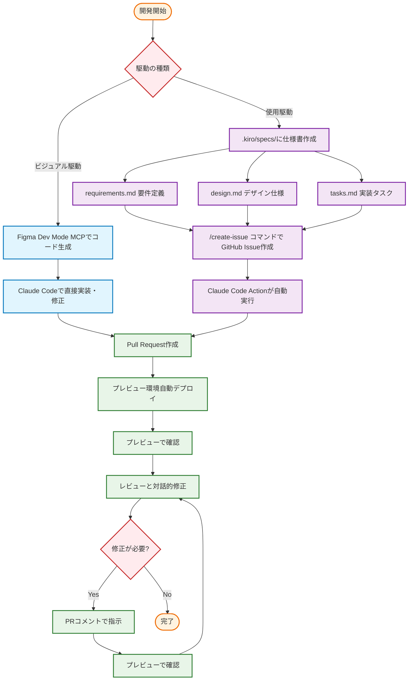

# Neuroware Guide - AI駆動型開発デモンストレーション

サイバネティック義肢製品の一括見積もりサイト - FigmaデザインからAIによる自動実装デモ

## 開発プロセス

入力に応じて2つの開発フローを使い分けます：



### ビジュアル駆動フロー

FigmaのURLやデザインファイルが提供された場合、Figma Dev Mode MCPを使用してデザインから直接コード生成を行います：

1. **Figma Dev Mode MCP**: デザインファイルからReactコンポーネントを自動生成
2. **Claude Codeによる実装**: 生成されたコードをプロジェクトに統合・カスタマイズ

### 仕様駆動フロー

機能要件が明確な場合、Kiro仕様管理システムを使用した構造化された開発を行います：

1. **仕様書作成**: `.kiro/specs/[機能名]/`に要件・デザイン・タスクを定義

   ```
   .kiro/specs/[機能名]/
   ├── requirements.md  # 要件定義（ユーザーストーリーと受け入れ基準）
   ├── design.md       # デザイン仕様（UIコンポーネントとスタイル）
   └── tasks.md        # 実装タスク（技術的な実装手順）
   ```

2. **Issue自動生成**: `/create-issue`コマンドで完全な仕様をGitHub Issueに変換

   > **💡 なぜIssueに保存するのか**  
   > `.kiro/specs`ディレクトリの内容をリポジトリに永続的に保持するのは管理が困難です。そのため、一度作成した仕様書の内容をGitHub Issueに記載することで、Claude Code Actionsが後から参照できる永続的なコンテキストとして保存します。これにより、仕様の詳細情報が失われることなく、自動実装プロセス全体を通して活用できます。

3. **自動実装**: Claude Code ActionsがIssueに保存された仕様に基づいてPRを自動作成

### 共通のPR・デプロイ・修正フロー

両方のフローは共通のPR作成からプレビュー・修正プロセスに合流します：

1. **Pull Request作成**: 実装内容をPRとして作成
2. **プレビュー環境自動デプロイ**: GitHub Pagesで自動デプロイ
3. **プレビュー確認**: 実装内容をブラウザで確認
4. **対話的修正**: レビューと修正指示のループ
5. **継続的改善**: PRコメントでの指示 → プレビュー確認を繰り返し

## 🧠 開発知識の蓄積

このプロジェクトでは、実装経験を体系的に蓄積し、次回の開発効率を向上させる知識管理システムを採用しています。

### 知識の管理

開発で得られた経験と学習内容は以下のファイルで管理されています：

1. **実装パターン** (`.kiro/steering/patterns.md`)
   - 再利用可能なReactコンポーネントパターン
   - TypeScript型定義のベストプラクティス
   - Tailwind CSSスタイリング手法
   - カスタムフックの実装方法

2. **課題解決事例** (`.kiro/steering/challenges.md`)
   - 技術的問題とその解決策
   - 試行錯誤のプロセス
   - パフォーマンス最適化手法
   - クロスブラウザ対応方法

3. **学習記録** (`.kiro/steering/lessons.md`)
   - プロジェクトで学んだ重要な教訓
   - 技術選定の判断基準
   - 開発プロセスの改善点
   - チームで共有すべき知見

### 知識の活用方法

開発時には、過去の経験を参考にすることで：

- **効率的な実装**: 実証済みのパターンを再利用
- **問題回避**: 過去の課題から学んだ予防策を適用
- **品質向上**: ベストプラクティスに基づいた実装
- **技術選定**: 経験に基づいた適切な技術判断

### 継続的な改善

各機能実装後に得られた知見は、適宜これらのファイルに追加され、プロジェクト全体の開発品質向上に貢献します。

## 詳細情報

プロジェクトの詳細については、以下のドキュメントを参照してください：

- **技術仕様**: [.kiro/steering/tech.md](.kiro/steering/tech.md)
- **プロジェクト構成**: [.kiro/steering/structure.md](.kiro/steering/structure.md)
- **プロダクト概要**: [.kiro/steering/product.md](.kiro/steering/product.md)
- **コミュニケーションルール**: [.kiro/steering/communication.md](.kiro/steering/communication.md)

---

このプロジェクトは、AI駆動型の開発プロセスを実証するデモンストレーション用途で構築されています。非開発者でも仕様書を作成してGitHub Issueを発行することで、自動的にコード実装とプレビュー環境の提供を受けることができます。
