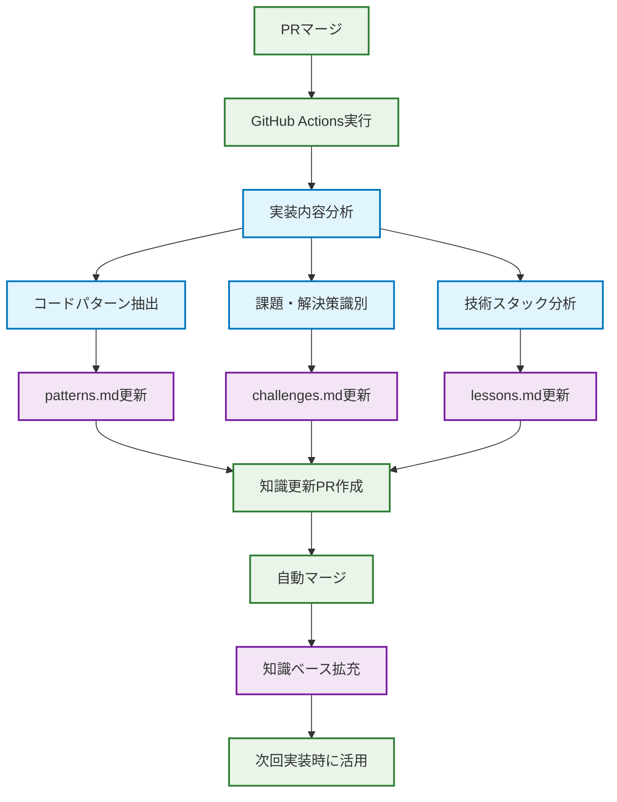

# Neuroware Guide - AI駆動型開発デモンストレーション

サイバネティック義肢製品の一括見積もりサイト - FigmaデザインからAIによる自動実装デモ

## 開発プロセス

入力に応じて2つの開発フローを使い分けます：


### ビジュアル駆動フロー

FigmaのURLやデザインファイルが提供された場合、Figma Dev Mode MCPを使用してデザインから直接コード生成を行います：

1. **Figma Dev Mode MCP**: デザインファイルからReactコンポーネントを自動生成
2. **Claude Codeによる実装**: 生成されたコードをプロジェクトに統合・カスタマイズ

### 仕様駆動フロー

機能要件が明確な場合、Kiro仕様管理システムを使用した構造化された開発を行います：

1. **仕様書作成**: `.kiro/specs/[機能名]/`に要件・デザイン・タスクを定義

   ```
   .kiro/specs/[機能名]/
   ├── requirements.md  # 要件定義（ユーザーストーリーと受け入れ基準）
   ├── design.md       # デザイン仕様（UIコンポーネントとスタイル）
   └── tasks.md        # 実装タスク（技術的な実装手順）
   ```

2. **Issue自動生成**: `/create-issue`コマンドで完全な仕様をGitHub Issueに変換

   > **💡 なぜIssueに保存するのか**  
   > `.kiro/specs`ディレクトリの内容をリポジトリに永続的に保持するのは管理が困難です。そのため、一度作成した仕様書の内容をGitHub Issueに記載することで、Claude Code Actionsが後から参照できる永続的なコンテキストとして保存します。これにより、仕様の詳細情報が失われることなく、自動実装プロセス全体を通して活用できます。

3. **自動実装**: Claude Code ActionsがIssueに保存された仕様に基づいてPRを自動作成

### 共通のPR・デプロイ・修正フロー

両方のフローは共通のPR作成からプレビュー・修正プロセスに合流します：

1. **Pull Request作成**: 実装内容をPRとして作成
2. **プレビュー環境自動デプロイ**: GitHub Pagesで自動デプロイ
3. **プレビュー確認**: 実装内容をブラウザで確認
4. **対話的修正**: レビューと修正指示のループ
5. **継続的改善**: PRコメントでの指示 → プレビュー確認を繰り返し

## 🔄 自動知識蓄積システム

このプロジェクトには、実装経験を自動的に蓄積し、次回の開発効率を向上させる知識学習サイクルが組み込まれています。

### 知識蓄積のタイミング

**PRマージ時の自動実行**:

```
機能実装PR → マージ → GitHub Actions自動実行 → 知識更新PR自動作成
```

### 蓄積される知識の種類

1. **実装経験** (`.kiro/steering/lessons.md`)
   - 使用した技術スタック
   - 発生した課題と解決策
   - 実装の難易度と再利用性
   - 次回への教訓

2. **再利用可能パターン** (`.kiro/steering/patterns.md`)
   - Reactコンポーネントのベストプラクティス
   - TypeScript型定義パターン
   - Tailwind CSSスタイリング手法
   - カスタムフックの実装方法

3. **課題解決事例** (`.kiro/steering/challenges.md`)
   - 技術的問題の詳細
   - 試行錯誤のプロセス
   - 最終的な解決方法
   - 予防策と参考資料

### 自動知識活用

**新機能開発時の知見活用**:

```bash
# 過去の経験を活用した仕様書自動強化
/enhance-specs 新機能名 --input="機能説明"

# 知見を含めた高品質なIssue作成
/create-issue 新機能名 --enhance
```

### 知識蓄積の流れ



### 学習効果の例

**初回実装**: ヘッダー統計表示

- モバイル表示で配置問題発生
- 試行錯誤で解決策発見
- 解決策を知識ベースに記録

**2回目実装**: 類似UI要素

- 過去の課題解決事例を自動参照
- 最初から適切な実装パターン適用
- 開発時間短縮・品質向上

### 人間の介入不要

- **自動実行**: PRマージで知識蓄積が自動開始
- **自動分析**: コード変更から学習ポイントを自動抽出
- **自動更新**: 知識ベースファイルを自動更新
- **自動活用**: 次回実装時に過去の知見を自動提案

この仕組みにより、開発チームの集合知が蓄積され、プロジェクトの成熟とともに開発効率が向上していきます。

## 詳細情報

プロジェクトの詳細については、以下のドキュメントを参照してください：

- **技術仕様**: [.kiro/steering/tech.md](.kiro/steering/tech.md)
- **プロジェクト構成**: [.kiro/steering/structure.md](.kiro/steering/structure.md)
- **プロダクト概要**: [.kiro/steering/product.md](.kiro/steering/product.md)
- **コミュニケーションルール**: [.kiro/steering/communication.md](.kiro/steering/communication.md)

---

このプロジェクトは、AI駆動型の開発プロセスを実証するデモンストレーション用途で構築されています。非開発者でも仕様書を作成してGitHub Issueを発行することで、自動的にコード実装とプレビュー環境の提供を受けることができます。
